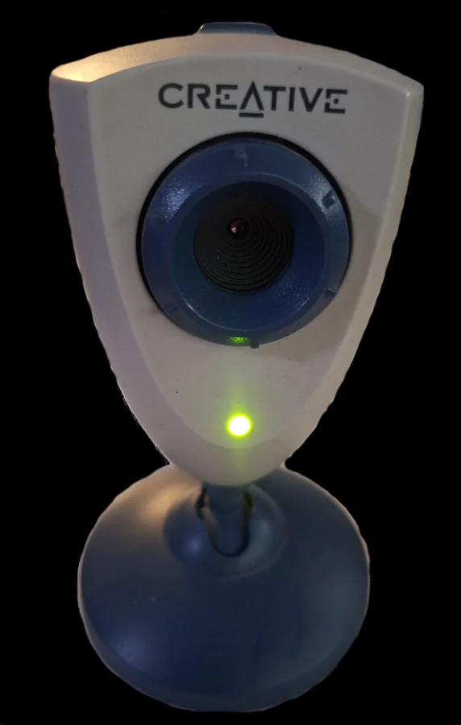
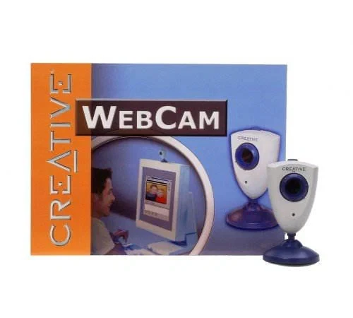

# ep800 — Creative PD1001 / Endpoints EP800 webcam driver

<p align="center">
  
  &nbsp;&nbsp;
  
</p>
<p align="center"><sub>
  <strong>Creative Webcam PD1001</strong> · <strong>JR012</strong> retail packaging
</sub></p>

> **Creative® WebCam™** is a great, easy-to-use USB camera for capturing video
> and still photos on a PC. It is elegant and modern, and gives users everything
> they need to take pictures, create full-colour motion video, and communicate
> over the Internet straight from the PC.
>
> Still photos can be taken with the convenient shutter button on the camera.
> The improved CMOS sensor works well in low light. Automatic exposure and white
> balance deliver a great image.
>
> Friendly bundled software — for example setting the camera for video up to
> 352×288, editing, saving, and finding video clips and photos — means Creative®
> WebCam™ is quick and easy to use.
>
> - Up to 30 frames per second at resolutions from 160×120 to 352×288
> - Still photos at 352×288 with the shutter button on the camera
> - Fast, simple install and connection via USB 1.1
> - Improved CMOS sensor (352×288) for a sharp, clean image
> - WebCam™ Control software for camera settings, capturing images and video,
>   and saving or finding them
> - Extra bundled software for video editing, videoconferencing, and more
>
> <sub>Period retail-box copy (JR012 / PD1001).</sub>

Out-of-tree Linux **V4L2** driver for Endpoints **EP800** USB cameras, including:

| Device | USB ID |
|--------|--------|
| Creative Webcam PD1001 | `041e:400d` |
| Endpoints EP800 reference | `03e8:1005` |

Protocol and EPLite/Bayer decoding are based on the historical
[epcam](https://sourceforge.net/projects/epcam/) driver (GPLv2+), rewritten for
modern kernels with **videobuf2**, DMA-safe USB control transfers, and a
workqueue-based decode path.

**Status:** works for capture (~2–3 fps on Full-Speed USB; period box copy
above claimed up to 30 fps). Colour and exposure are usable but rough. Prefer
testing in a VM first if you are developing the module
([docs/vm-testing.md](docs/vm-testing.md)).

<p align="center">
  
</p>
<p align="center"><sub>
  Live preview in VLC (<code>v4l2:///dev/video…</code>) using this driver
</sub></p>

## Requirements

- Linux 6.x headers for the running kernel (`linux-headers-$(uname -r)`)
- `build-essential`, `dkms` (for the Debian package)

## Quick start (DKMS)

```bash
# from a release .deb, or build one:
dpkg-buildpackage -b -us -uc
sudo dpkg -i ../ep800-dkms_*.deb
sudo modprobe ep800
v4l2-ctl --list-devices
```

## Manual build

```bash
make
sudo insmod ./ep800.ko
# sudo insmod ./ep800.ko debug=1
# sudo insmod ./ep800.ko force_bayer=1
sudo rmmod ep800
```

## Using the camera

```bash
v4l2-ctl --list-devices
v4l2-ctl -d /dev/video0 --all

# VLC (GUI — prefer this; exits when you close the window)
vlc v4l2:///dev/video0 :v4l2-width=176 :v4l2-height=144 :v4l2-chroma=BGR3

# VLC (CLI). If the X window dies (`xcb_window … X server failure`), cvlc
# often keeps running on a dummy interface — press Ctrl+C in that terminal
# (or: pkill -f 'v4l2:///dev/video').
cvlc v4l2:///dev/video0 :v4l2-width=176 :v4l2-height=144 :v4l2-chroma=BGR3

# timed CLI smoke test (always exits)
cvlc -I dummy v4l2:///dev/video0 --vout=dummy --aout=dummy --run-time=5 vlc://quit

# FFmpeg / ffplay (specify format if auto-probe stalls)
ffplay -f v4l2 -input_format bgr24 -video_size 176x144 -i /dev/video0
ffmpeg -f v4l2 -input_format bgr24 -video_size 176x144 -i /dev/video0 -frames:v 1 shot.jpg
v4l2-ctl -d /dev/video0 --stream-mmap --stream-count=5
```

Replace `/dev/video0` with the node shown for **Creative PD1001**.

## Formats and controls

- Pixel format: `BGR24` (`BGR3`)
- Sizes: 176×144, 320×240, 352×288, 400×300 (within sensor max)
- Controls: brightness, contrast, saturation, hue
- Snapshot button: Linux input `KEY_CAMERA` (vendor interrupt endpoint, not HID)

```bash
grep PD1001 /sys/class/input/*/name
sudo evtest   # select "Creative PD1001 Button", press the top button
```

## Package layout

```
ep800.c / ep800.h   driver sources
Makefile            out-of-tree kbuild
dkms.conf           DKMS recipe
debian/             Debian packaging (ep800-dkms)
docs/               documentation and screenshots
docs/images/        PD1001 / JR012 photos + VLC preview
scripts/            helper scripts
legacy/epcam-0.9/   historical epcam 0.9 sources (reference only)
```

## License

GPL-2.0-or-later. See [LICENSE](LICENSE) and [debian/copyright](debian/copyright).

## Credits

- Original epcam: Jeroen B. Vreeken and later contributors (SourceForge epcam)
- Modern V4L2 port: Vítězslav Dvořák
